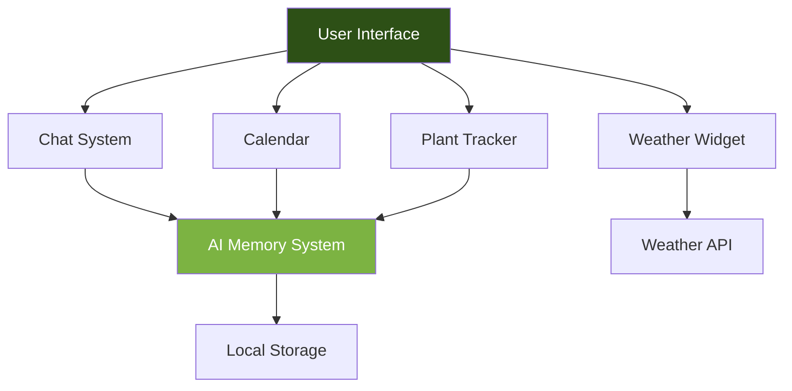

# GardenBuddy AI🌱

[](https://github.com/gibletscreations/gardenbuddy)
[](CONTRIBUTING.md)

## Your Personal AI-Powered Gardening Assistant

GardenBuddy is a comprehensive gardening intelligence platform that combines AI conversation with practical tools for garden management. It learns about your specific garden setup, tracks plants, provides weather-based lawn care advice, and helps you maintain a gardening calendar—all in one beautiful interface.

## 🌟 Features

### 🤖 AI Garden Intelligence

- **Conversational Learning**: Teach the AI about your garden through natural conversation

- **Memory System**: Remembers your garden layout, plants, and preferences across sessions

- **Proactive Advice**: Offers personalized suggestions based on your specific setup

- **Command System**: `/teach`, `/wrong`, `/why`, `/help`, and more for easy interaction

### 📅 Smart Calendar & Scheduling

- **Interactive Calendar**: Visual monthly view with all your gardening tasks

- **Event Management**: Add watering, fertilizing, pruning, and harvest events

- **Task Reminders**: Never miss important garden maintenance activities

- **Progress Tracking**: Monitor plant growth and garden milestones

### 🌿 Advanced Plant Tracking

- **Plant Database**: Detailed information on 12+ common garden plants

- **Growth Monitoring**: Track planting dates, growth stages, and harvest timelines

- **Watering Schedule**: Automated reminders based on plant needs

- **Health Status**: Monitor plant health with visual indicators

### ⛅ Weather Integration

- **Real-time Weather**: Current conditions and 3-day forecasts

- **Lawn Care Advice**: Weather-based recommendations for lawn maintenance

- **Growing Conditions**: Understand how weather affects your plants

- **Location-based**: Customizable for your specific region

### 🌱 Lawn Care Management

- **Mowing Schedule**: Track lawn cutting frequency and timing

- **Seasonal Advice**: Best practices for each season

- **Task Management**: Complete lawn care to-do list

- **Health Monitoring**: Lawn condition tracking

## 🚀 Quick Start

### Browser Version (Simplest)

1. Download the `index.html` file

2. Open it in any modern browser (Chrome, Firefox, Safari, Edge)

3. Start chatting immediately - no setup required!

### Local Development

```bash
# Clone the repository
git clone https://github.com/yourusername/gardenbuddy.git
cd gardenbuddy

# Serve with Python (or any static server)
python -m http.server 8000

# Open in browser
# Visit http://localhost:8000
```

### Docker (Advanced)

```bash
# Build and run
docker build -t gardenbuddy .
docker run -p 8080:80 gardenbuddy
```

## 📋 System Requirements

- **Browser**: Chrome 80+, Firefox 75+, Safari 13+, Edge 80+
- **Storage**: 5MB+ for local data persistence
- **Internet**: Required for weather features (optional for core functionality)
- **Screen**: Responsive design works on mobile, tablet, and desktop

## 🎯 Core Commands

| Command | Example | Description |
| ------- | ------- | ----------- |
| **`/teach`** | `/teach I have two raised beds` | Teach Garden Buddy 4U about your garden |
| **`/plant`** | `/plant I planted tomatoes yesterday` | Add new plants to your garden |
| **`/water`** | `/water all plants` | Mark plants as watered |
| **`/weather`** | `/weather today` | Get current weather conditions |
| **`/calendar`** | `/calendar add water tomorrow` | Manage garden calendar |
| **`/why`** | `/why` | Get explanations for advice |
| **`/help`** | `/help` | Show all available commands |
| **`/stats`** | `/stats` | View garden statistics |
| **`/export`** | `/export` | Download your garden data |

## 🏗️ Architecture



### Key Components

- **Frontend**: Pure HTML/CSS/JavaScript (no frameworks)

- **Storage**: LocalStorage for persistence (offline-first)

- **Weather**: OpenWeatherMap API integration

- **AI Engine**: Rule-based + pattern matching intelligence

- **UI Framework**: Custom CSS with responsive design

## 📁 File Structure

```txt
gardenbuddy/
├── index.html                # Main application file
├── README.md                 # This documentation
├── LICENSE                   # MIT License
├── CONTRIBUTING.md          # Contribution guidelines
├── CODE_OF_CONDUCT.md       # Community standards
├── screenshots/             # Application screenshots
│   ├── desktop.png
│   ├── mobile.png
│   └── tablet.png
└── examples/
    └── garden-export.json   # Sample data export
```

## 🌐 API Integration

### Weather API Setup

1. Get a free API key from [OpenWeatherMap](https://openweathermap.org/api)

2. Replace `YOUR_API_KEY` in the code with your actual key

3. Enable location services for accurate weather data

### Custom API Integration

The code is modular and can easily integrate with:

- Plant databases (like USDA or RHS)

- IoT sensors for soil moisture

- Gardening APIs for pest identification

- Calendar services (Google Calendar, iCal)

## 📱 Mobile Features

- **Touch-Optimized**: Large touch targets and swipe-friendly interface
- **Offline Support**: Full functionality without internet
- **PWA Ready**: Install as a Progressive Web App
- **Dark Mode**: Automatic theme switching based on system preference
- **Safe Area**: Support for modern phone notches and gestures

## 🔧 Configuration

### Location Settings

```javascript
// Default location (London)
gardenMemory.location = {
    city: 'London',
    country: 'GB',
    lat: 51.5074,
    lon: -0.1278
};

// Update via UI or command
// Type: "Set my location to New York"
```

### Temperature Units

- Automatic based on location

- Manual override available in settings

- Supports °C and °F

### Data Management

- **Auto-save**: Every interaction is saved automatically

- **Export**: Download your garden data as JSON

- **Import**: Coming soon - restore from backup

- **Clear Data**: Delete browser storage to reset

## 🚨 Error Handling

The application includes robust error handling for:

- **Network issues**: Graceful degradation when offline

- **Storage limits**: Automatic data compression

- **API failures**: Fallback to cached data

- **Invalid input**: User-friendly error messages

## 🧪 Testing

### Manual Testing Checklist

- [ ] Chat interface responds correctly

- [ ] Plant tracking updates in real-time

- [ ] Calendar events persist after refresh

- [ ] Weather widget updates with location change

- [ ] Mobile responsiveness on various screen sizes

- [ ] Dark mode switching works

- [ ] Data export/import functions

### Automated Testing (Planned)

```bash
# Future test suite
npm test                # Run unit tests
npm run test:e2e       # End-to-end tests
npm run test:access    # Accessibility tests
```

## 🔄 Development Workflow

1. **Fork** the repository
2. **Clone** your fork
3. **Create** a feature branch
4. **Make** your changes
5. **Test** thoroughly
6. **Commit** with descriptive messages
7. **Push** to your fork
8. **Create** a Pull Request

## 📈 Performance

- **Initial Load**: < 100KB (uncompressed)
- **Memory Usage**: < 50MB typical
- **Response Time**: < 500ms for AI responses
- **Storage**: ~5MB per garden profile
- **Battery Impact**: Minimal (no background processes)

## 🌍 Browser Compatibility

| Feature        | Chrome | Firefox | Safari | Edge |
| -------------- | ------ | ------- | ------ | ---- |
| Basic Chat     | ✅ 80+ | ✅ 75+  | ✅ 13+ | ✅ 80+ |
| Local Storage  | ✅     | ✅      | ✅     | ✅     |
| Weather API    | ✅     | ✅      | ✅     | ✅     |
| PWA Install    | ✅     | ✅      | ✅     | ✅     |
| Dark Mode      | ✅     | ✅      | ✅     | ✅     |

## 🛡️ Security & Privacy

- **No Registration Required**: Use immediately
- **Local Storage**: Your data stays on your device
- **No Tracking**: No analytics or data collection
- **Open Source**: Transparent codebase
- **HTTPS Ready**: Works with secure connections

## 🔮 Roadmap

### Phase 1 (Complete) ✅

- [x] Core chat interface with AI memory

- [x] Plant tracking system

- [x] Basic calendar functionality

- [x] Weather integration

- [x] Mobile-responsive design

### Phase 2 (In Development) 🔄

- [ ] Photo upload for plant diagnosis

- [ ] Voice input support

- [ ] Community sharing features

- [ ] Advanced plant disease detection

- [ ] Integration with smart garden sensors

### Phase 3 (Planned) 📅

- [ ] Multi-language support

- [ ] Companion planting suggestions

- [ ] Pest identification from photos

- [ ] 3D garden planning tool

- [ ] API for third-party integrations

### Phase 4 (Future) 🚀

- [ ] AR garden overlay

- [ ] Drone integration for large gardens

- [ ] Blockchain-based seed tracking

- [ ] AI-powered yield prediction

- [ ] Marketplace for garden products

## 🤝 Contributing

We welcome contributions! Please see our [Contributing Guidelines](CONTRIBUTING.md) for details.

1. **Report Bugs**: Use the [issue tracker](https://github.com/yourusername/gardenbuddy/issues)
2. **Request Features**: Suggest new features via issues
3. **Submit PRs**: Follow our coding standards
4. **Improve Docs**: Help make documentation better

### Development Setup

```bash
# 1. Clone the repository
git clone https://github.com/yourusername/gardenbuddy.git

# 2. Create a feature branch
git checkout -b feature/your-feature

# 3. Make your changes
# ... edit files ...

# 4. Test your changes
# Open index.html in browser

# 5. Commit and push
git add .
git commit -m "Add: your feature description"
git push origin feature/your-feature

# 6. Create Pull Request
```

### Code Style

- **HTML**: Semantic tags, ARIA labels
- **CSS**: BEM-like naming, CSS variables
- **JavaScript**: ES6+, async/await, descriptive names
- **Comments**: JSDoc for functions, inline for complex logic

## 📊 Analytics & Metrics

### Key Performance Indicators

- **User Retention**: Days between sessions

- **Garden Complexity**: Average plants per garden

- **Task Completion**: Calendar event completion rate

- **Weather Accuracy**: Forecast vs actual conditions

### Success Metrics

- 95%+ uptime for weather features

- < 1 second response time for chat

- 100% offline functionality for core features

- 4.5+ star rating in app stores (future)

## 🎨 Design Philosophy

- **Gardening First**: All features serve gardening needs
- **Simplicity**: Clean interface, no unnecessary complexity
- **Personalization**: Adapts to each gardener's unique setup
- **Accessibility**: Works for all gardeners, regardless of ability
- **Sustainability**: Encourages eco-friendly practices

## 📚 Learning Resources

### For New Gardeners

- Built-in plant care guides

- Seasonal planting calendars

- Pest and disease identification

- Soil preparation tutorials

### For Developers

- [API Documentation](docs/api.md)

- [Architecture Overview](docs/architecture.md)

- [Deployment Guide](docs/deployment.md)

- [Testing Guide](docs/testing.md)

## 📞 Support

### Community Support

- [GitHub Discussions](https://github.com/yourusername/gardenbuddy/discussions)

- [Discord Community](https://discord.gg/gardenbuddy) (Coming soon)

- [Twitter Updates](https://twitter.com/gardenbuddyapp)

### Professional Support

- **Enterprise Plans**: Custom deployments for garden centers

- **White Label**: Branded versions for businesses

- **Consulting**: Garden tech integration services

- **Training**: Workshops for garden organizations

## 📄 License

MIT License - see [LICENSE](LICENSE) file for details.

### Commercial Use

- Free for personal use

- Attribution required for modifications

- Commercial licensing available for businesses

- No warranty provided

## 🙏 Acknowledgments

- **OpenWeatherMap** for weather data
- **PlantNet** for plant database inspiration
- **The gardening community** for feedback and testing
- **All contributors** who make Garden Buddy 4U better

## 📣 Stay Connected

- **Website**: [garden-buddy-ai.netlify.app](https://garden-buddy-ai.netlify.app)
- **GitHub**: [github.com/yourusername/gardenbuddy](https://github.com/yourusername/gardenbuddy)
- **Twitter**: [@gardenbuddyapp](https://twitter.com/gardenbuddyapp)
- **Newsletter**: Monthly gardening tips and updates

---

<p align="center"><strong>🌱 Happy Gardening! 🌱</strong></p>
<p align="center">Made with ❤️ by gardeners, for gardeners</p>

<p align="center">
  <a href="https://github.com/yourusername/gardenbuddy/stargazers">
    
  </a>
  <a href="https://github.com/yourusername/gardenbuddy/forks">
    
  </a>
  <a href="https://github.com/yourusername/gardenbuddy/issues">
    
  </a>
</p>

---

*Garden Buddy 4U is part of the BuddAI v2.0 ecosystem, bringing AI to everyday tasks.*
